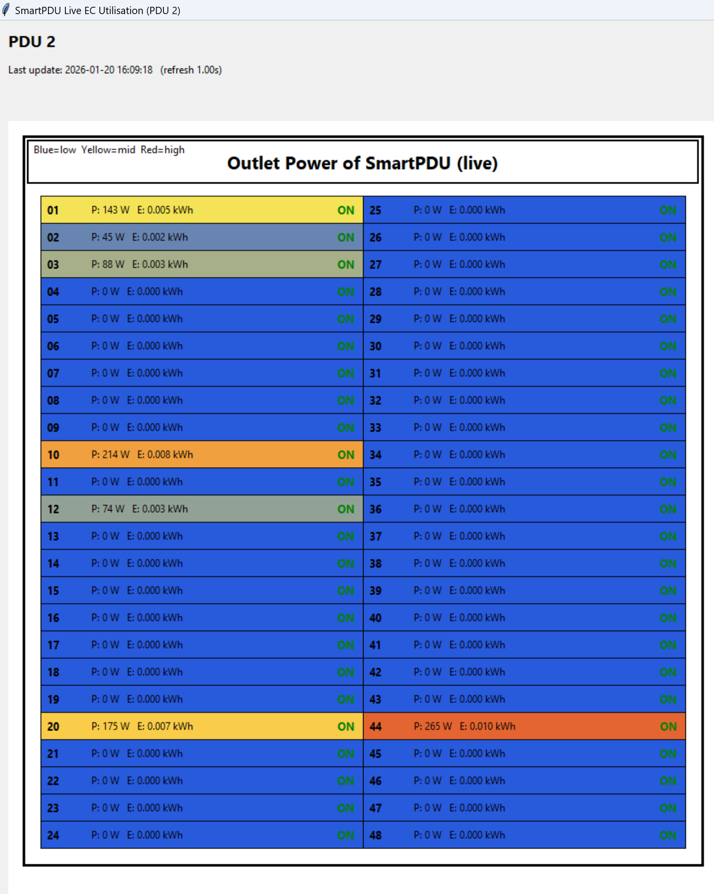
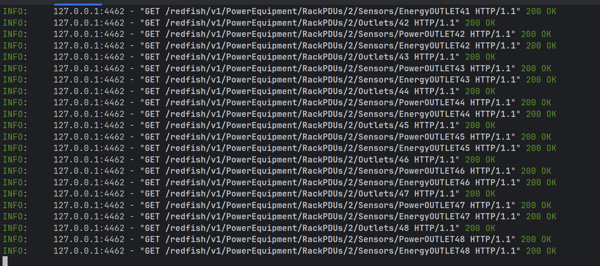

Mock Schneider SmartPDU (Redfish) + Live GUI
============================================

This project provides a **self-contained mock implementation of a Schneider Electric SmartPDU Redfish API**, together with a **real-time GUI** that visualizes outlet-level energy consumption as a heat map.

It is designed specifically to support **energy and carbon (EC) aggregation client development**, integration testing, and visualization — without requiring physical PDU hardware.

Features
--------

### Mock SmartPDU Backend

*   Implements **SmartPDU-style Redfish endpoints**
*   Redfish-like payload shapes:
    *   @odata.id, @odata.type    
    *   Collections with Members and Members@odata.count
    *   Status { State, Health }
    *   Sensors with Reading and ReadingUnits
        
*   Supports:
    *   SessionService
    *   AccountService
    *   Managers
    *   PowerEquipment / RackPDUs
    *   Outlets, Branches, Mains
    *   Power, Energy, Voltage, Current, Frequency sensors
    *   EventService subscriptions
    *   Load segment power control
        
*   Generates **plausible, internally consistent electrical data**:
    *   Power ≈ Voltage × Current
    *   Energy counters
    *   PDU totals

### Live GUI   
*   **Heat map coloring based on live outlet power**   
    *   Blue → low power
    *   Yellow → medium power
    *   Red → high power
*   ON / OFF state
*   Live polling from the mock Redfish API

       
## Screenshots
Gui Front End

Mockup Backend

    
Quick Start
-----------

### 1\. Clone the repository

git clone https://github.com/oabboud/smartPDU-mockup.git

### 2\. Install dependencies

pip install fastapi uvicorn requests pytest

Running the Mock SmartPDU Backend
---------------------------------

Start the Redfish-style SmartPDU API:

uvicorn mock_pdu_api:app --host 127.0.0.1 --port 8000

The API will be available at:
http://127.0.0.1:8000/redfish/v1/

### Default credentials

*   Username: admin
*   Password: 123456789
  
Basic authentication is required for all GET and DELETE requests.

Running the Live GUI
--------------------

With the backend running in another terminal:

python pdu_live_gui_heatmap.py --base-url http://127.0.0.1:8000 --pdu-id 2 --user admin --password 123456789 --refresh 1.0 --autoscale

Testing the Backend
-------------------

Run the API test suite:

pytest -q

The tests validate:

*   Redfish-style payload shapes
*   Authentication behavior
*   Sensor consistency
*   Energy monotonicity
*   Load segment power control
*   Event subscription lifecycle
    
Intended Use Cases
------------------

*   EC aggregation client development
*   Redfish polling logic validation
*   Unit and integration testing without hardware
*   Power / energy visualization demos

## Acknowledgement
This work has been funded by the European Commission Horizon Europe Smart Networks and Services Joint Undertaking (SNS JU) EXIGENCE Project (Grant Agreement No. 101139120).

[Exigence Overview on YouTube](https://www.youtube.com/watch?v=LcXthE6rZCM&t=50s)
